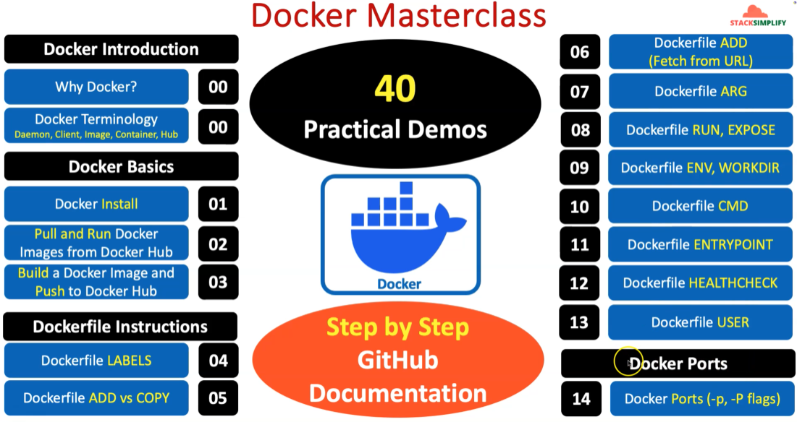
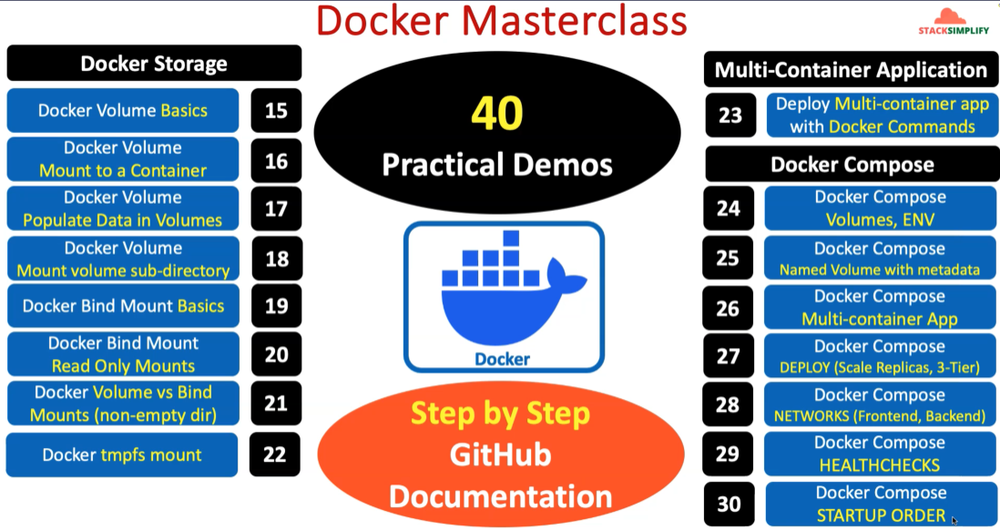
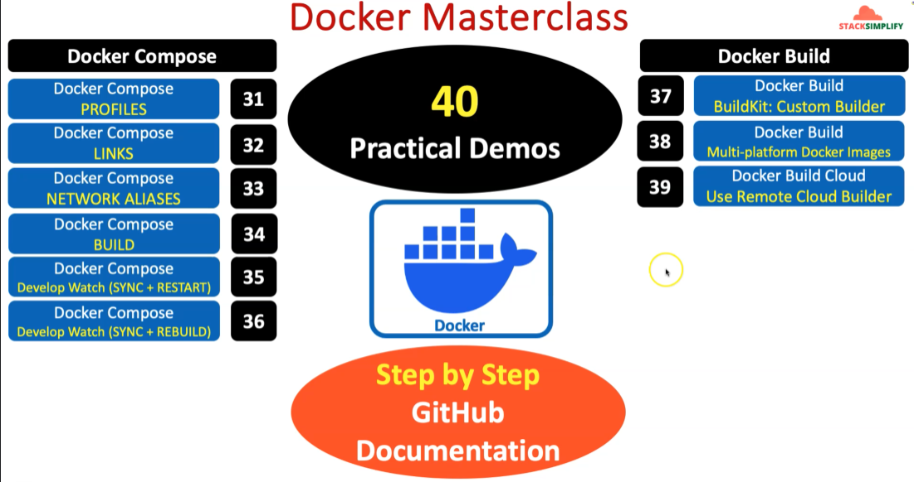

# Docker Masterclass — Study Plan

> **Source:** StackSimplify Docker Masterclass curriculum  
> **Format:** 40 practical demos with step-by-step GitHub documentation  
> **Curriculum maps:** [Part 1](../images/study-plan/01-study-plan-part-1.png) · [Part 2](../images/study-plan/02-study-plan-part-2.png) · [Part 3](../images/study-plan/02-study-plan-part-3.png)

---

## How to Use This Plan

1. Work through modules in order — later topics build on earlier ones.
2. For each module: read the concept → run the demo → complete hands-on practice.
3. Mark status as you go: `[ ]` not started · `[~]` in progress · `[x]` done.
4. Cross-reference repo docs and labs listed under **Repo resources**.

---

## Section 1: Docker Introduction

| # | Module | Topics | Status | Repo resources |
|---|--------|--------|--------|----------------|
| 00 | Why Docker? | Containers vs VMs, benefits, use cases | `[ ]` | — |
| 00 | Docker Terminology | Daemon, Client, Image, Container, Hub | `[ ]` | — |

**Goals:** Understand *why* Docker exists and speak the core vocabulary before touching the CLI.

---

## Section 2: Docker Basics

| # | Module | Topics | Status | Repo resources |
|---|--------|--------|--------|----------------|
| 01 | Docker Install | Install Docker Engine on Linux / WSL | `[ ]` | — |
| 02 | Pull and Run Docker Images from Docker Hub | `docker pull`, `docker run`, `docker ps` | `[ ]` | [01-commands.MD](../01-misc/01-commands.MD) |
| 03 | Build a Docker Image and Push to Docker Hub | `docker build`, `docker tag`, `docker push` | `[ ]` | [01-custom-nginx-image](../03-docker-files/01-custom-nginx-mage/) · [02-devops-navigator](../03-docker-files/02-custom-nginx-image-devops-navigator/) |

**Goals:** Install Docker, run existing images, and publish your first custom image.

---

## Section 3: Dockerfile Instructions

| # | Module | Topics | Status | Repo resources |
|---|--------|--------|--------|----------------|
| 04 | Dockerfile LABELS | Metadata, OCI labels, `docker inspect` | `[ ]` | [02-docker-file-instructions/01-LABELS.MD](../02-docker-file-instructions/01-LABELS.MD) · [03-labels lab](../03-docker-files/03-labels/) |
| 05 | Dockerfile ADD vs COPY | When to use each, best practices | `[ ]` | [02-docker-file-instructions/02-ADD-vs-COPY.MD](../02-docker-file-instructions/02-ADD-vs-COPY.MD) · [04-add-vs-copy lab](../03-docker-files/04-add-vs-copy/) |
| 06 | Dockerfile ADD (Fetch from URL) | Remote tar/artifact fetch with `ADD` | `[ ]` | [05-add-from-url lab](../03-docker-files/05-add-from-url/) |
| 07 | Dockerfile ARG | Build-time variables, defaults, scope | `[ ]` | [02-docker-file-instructions/03-ARG.MD](../02-docker-file-instructions/03-ARG.MD) · [06-ARG lab](../03-docker-files/06-ARG/) |
| 08 | Dockerfile RUN, EXPOSE | Shell vs exec form, documenting ports | `[ ]` | [00-all-docker-file-instructions.MD](../02-docker-file-instructions/00-all-docker-file-instructions.MD) |
| 09 | Dockerfile ENV, WORKDIR | Runtime env vars, working directory | `[ ]` | [00-all-docker-file-instructions.MD](../02-docker-file-instructions/00-all-docker-file-instructions.MD) |
| 10 | Dockerfile CMD | Default container command, exec vs shell | `[ ]` | [00-all-docker-file-instructions.MD](../02-docker-file-instructions/00-all-docker-file-instructions.MD) |
| 11 | Dockerfile ENTRYPOINT | Fixed entrypoint, CMD as default args | `[ ]` | [00-all-docker-file-instructions.MD](../02-docker-file-instructions/00-all-docker-file-instructions.MD) |
| 12 | Dockerfile HEALTHCHECK | Container health probes, intervals | `[ ]` | [00-all-docker-file-instructions.MD](../02-docker-file-instructions/00-all-docker-file-instructions.MD) |
| 13 | Dockerfile USER | Non-root containers, security | `[ ]` | [00-all-docker-file-instructions.MD](../02-docker-file-instructions/00-all-docker-file-instructions.MD) · [00-dockerfile-industry-standards](../03-docker-files/00-dockerfile-industry-standards-best-practices.MD) |

**Goals:** Read and write production-quality Dockerfiles using every core instruction.

**Reference:** [Complete Dockerfile instructions guide](../02-docker-file-instructions/00-all-docker-file-instructions.MD)

---

## Section 4: Docker Ports

| # | Module | Topics | Status | Repo resources |
|---|--------|--------|--------|----------------|
| 14 | Docker Ports (`-p`, `-P` flags) | Port mapping, publish all ports | `[ ]` | [01-commands.MD](../01-misc/01-commands.MD) |

**Goals:** Expose container services to the host and understand implicit vs explicit port publishing.

---

## Section 5: Docker Storage

| # | Module | Topics | Status | Repo resources |
|---|--------|--------|--------|----------------|
| 15 | Docker Volume Basics | Named volumes, `docker volume` commands | `[ ]` | — |
| 16 | Docker Volume Mount to a Container | `-v` / `--mount` syntax | `[ ]` | — |
| 17 | Docker Volume Populate Data in Volumes | Init containers, seeding data | `[ ]` | — |
| 18 | Docker Volume Mount volume sub-directory | Sub-path mounts | `[ ]` | — |
| 19 | Docker Bind Mount Basics | Host path → container path | `[ ]` | — |
| 20 | Docker Bind Mount Read Only Mounts | `:ro` flag, immutability | `[ ]` | — |
| 21 | Docker Volume vs Bind Mounts (non-empty dir) | Behavior when target dir exists | `[ ]` | — |
| 22 | Docker tmpfs mount | In-memory ephemeral storage | `[ ]` | — |

**Goals:** Choose the right storage strategy — volume, bind mount, or tmpfs — for each workload.

---

## Section 6: Multi-Container Application

| # | Module | Topics | Status | Repo resources |
|---|--------|--------|--------|----------------|
| 23 | Deploy Multi-container app with Docker Commands | Manual linking, networks, env | `[ ]` | — |

**Goals:** Run a multi-service app using raw `docker run` before introducing Compose.

---

## Section 7: Docker Compose

| # | Module | Topics | Status | Repo resources |
|---|--------|--------|--------|----------------|
| 24 | Docker Compose Volumes, ENV | `docker-compose.yml` basics | `[ ]` | — |
| 25 | Docker Compose Named Volume with metadata | Labels on volumes | `[ ]` | — |
| 26 | Docker Compose Multi-container App | Services, depends_on | `[ ]` | — |
| 27 | Docker Compose DEPLOY (Scale Replicas, 3-Tier) | `deploy.replicas`, 3-tier architecture | `[ ]` | — |
| 28 | Docker Compose NETWORKS (Frontend, Backend) | Custom networks, isolation | `[ ]` | — |
| 29 | Docker Compose HEALTHCHECKS | Service-level health checks | `[ ]` | — |
| 30 | Docker Compose STARTUP ORDER | `depends_on` + condition | `[ ]` | — |
| 31 | Docker Compose PROFILES | Profile-based service activation | `[ ]` | — |
| 32 | Docker Compose LINKS | Legacy service linking | `[ ]` | — |
| 33 | Docker Compose NETWORK ALIASES | DNS aliases within networks | `[ ]` | — |
| 34 | Docker Compose BUILD | Build context in Compose | `[ ]` | — |
| 35 | Docker Compose Develop Watch (SYNC + RESTART) | Hot-reload with file sync | `[ ]` | — |
| 36 | Docker Compose Develop Watch (SYNC + REBUILD) | Rebuild on file change | `[ ]` | — |

**Goals:** Define, run, scale, and develop multi-service stacks declaratively with Compose.

---

## Section 8: Docker Build

| # | Module | Topics | Status | Repo resources |
|---|--------|--------|--------|----------------|
| 37 | Docker Build — BuildKit: Custom Builder | Buildx, custom builder instances | `[ ]` | — |
| 38 | Docker Build — Multi-platform Docker Images | `linux/amd64`, `linux/arm64` builds | `[ ]` | — |
| 39 | Docker Build Cloud — Use Remote Cloud Builder | Cloud-based remote builds | `[ ]` | — |

**Goals:** Use modern BuildKit/Buildx for faster, cross-platform, and cloud-backed image builds.

---

## Suggested Learning Path

```
Week 1   → Sections 1–2   (Intro + Basics)           Modules 00–03
Week 2   → Section 3      (Dockerfile Instructions)    Modules 04–13
Week 3   → Sections 4–5   (Ports + Storage)            Modules 14–22
Week 4   → Sections 6–7   (Multi-container + Compose)  Modules 23–36
Week 5   → Section 8      (Docker Build)               Modules 37–39
```

Adjust pace to your schedule. Dockerfile instructions (Section 3) deserve extra time — they are the foundation for everything that follows.

---

## Progress Tracker

| Section | Modules | Completed | Progress |
|---------|---------|-----------|----------|
| 1 — Docker Introduction | 2 | 0 / 2 | ⬜⬜⬜⬜⬜ 0% |
| 2 — Docker Basics | 3 | 0 / 3 | ⬜⬜⬜⬜⬜ 0% |
| 3 — Dockerfile Instructions | 10 | 0 / 10 | ⬜⬜⬜⬜⬜ 0% |
| 4 — Docker Ports | 1 | 0 / 1 | ⬜⬜⬜⬜⬜ 0% |
| 5 — Docker Storage | 8 | 0 / 8 | ⬜⬜⬜⬜⬜ 0% |
| 6 — Multi-Container App | 1 | 0 / 1 | ⬜⬜⬜⬜⬜ 0% |
| 7 — Docker Compose | 13 | 0 / 13 | ⬜⬜⬜⬜⬜ 0% |
| 8 — Docker Build | 3 | 0 / 3 | ⬜⬜⬜⬜⬜ 0% |
| **Total** | **41*** | **0 / 41** | **0%** |

\*Module 00 appears twice (Why Docker? + Terminology) — counted as 2 items.

---

## Supplementary Materials in This Repo

| Resource | Path | Use for |
|----------|------|---------|
| Docker commands cheat sheet | [01-misc/01-commands.MD](../01-misc/01-commands.MD) | Quick CLI reference (Modules 01–14) |
| All Dockerfile instructions | [02-docker-file-instructions/](../02-docker-file-instructions/) | Deep dives (Modules 04–13) |
| Hands-on Dockerfile labs | [03-docker-files/](../03-docker-files/) | Practical demos (Modules 03–07) |
| Dockerfile best practices | [03-docker-files/00-dockerfile-industry-standards-best-practices.MD](../03-docker-files/00-dockerfile-industry-standards-best-practices.MD) | Production standards (Module 13+) |
| IQ / scenario questions | [01-misc/iq-set-01.md](../01-misc/iq-set-01.md) · [01-misc/scenario-based-iq-01.MD](../01-misc/scenario-based-iq-01.MD) | Self-assessment after each section |

---

## Curriculum Overview (Visual)






