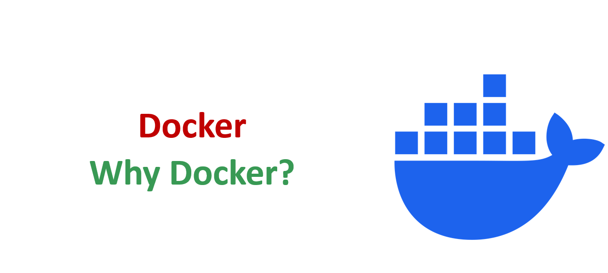
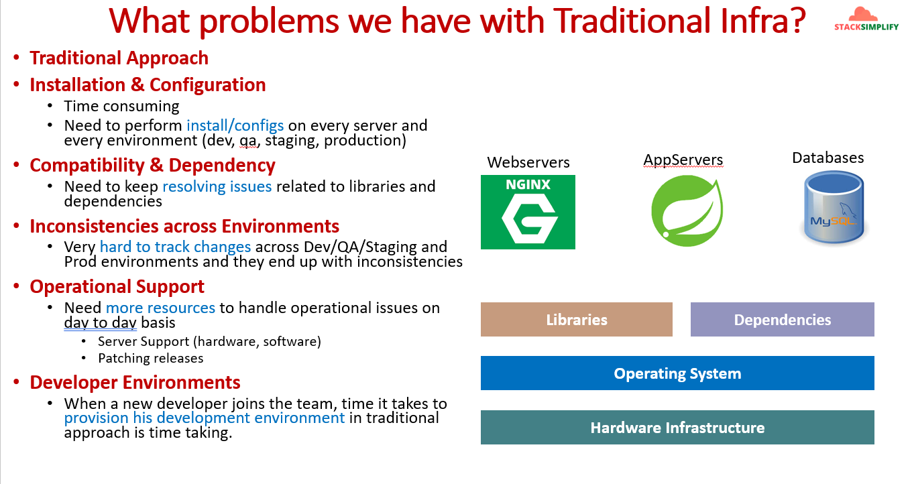
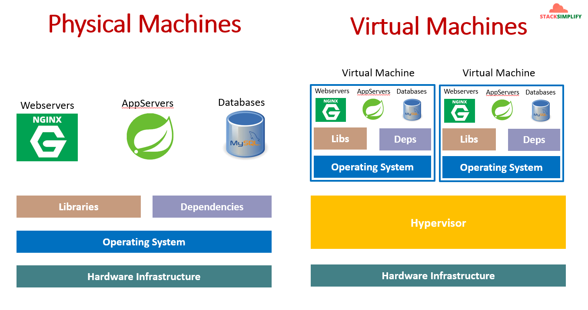
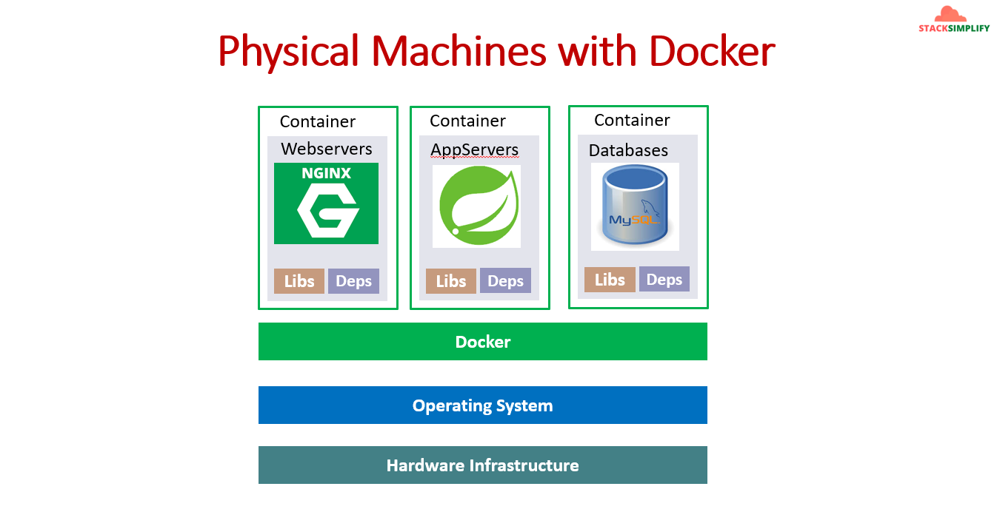
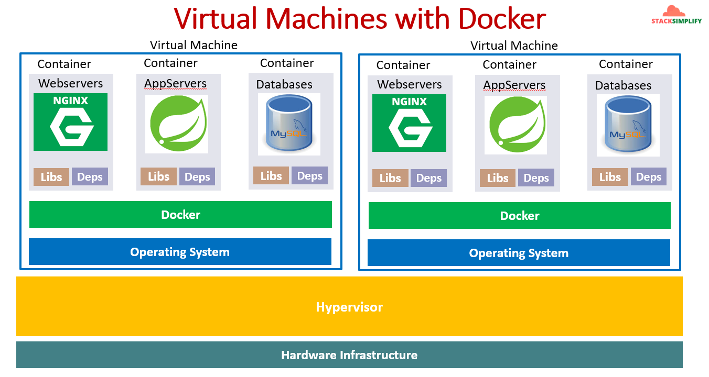
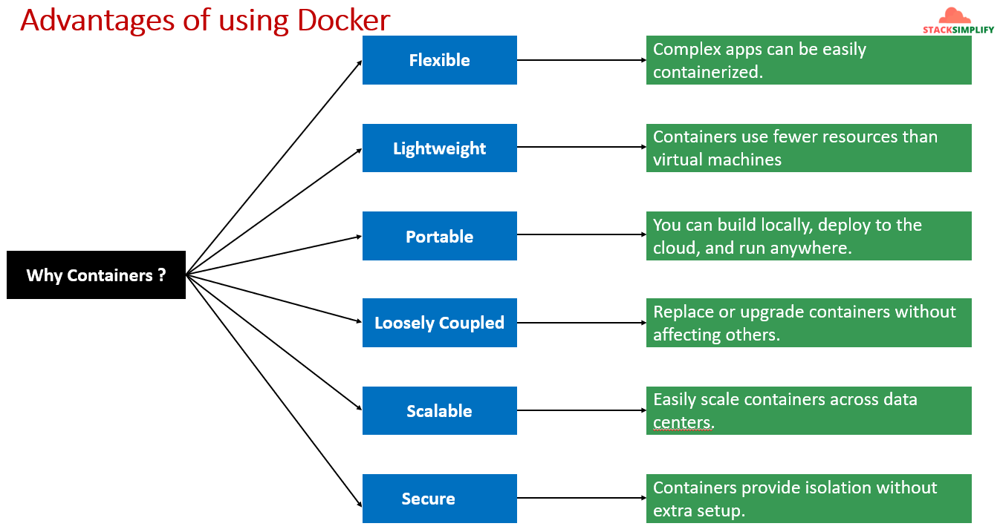

# Why Docker? — Complete Theory Guide

> **Module:** 00 — Why Docker?  
> **Source:** StackSimplify Docker Masterclass  
> **Visual references:** [images/why-docker/](../images/why-docker/)



---

## Table of Contents

1. [Introduction (Why & What)](#1-introduction-why--what)
2. [Internal Working (How)](#2-internal-working-how)
3. [Real-World Context](#3-real-world-context)
4. [Hands-On Practice](#4-hands-on-practice)
5. [Common Mistakes](#5-common-mistakes)
6. [Best Practices & Security](#6-best-practices--security)
7. [Interview Preparation](#7-interview-preparation)
8. [Summary](#8-summary)
9. [Practice Assignment](#9-practice-assignment)

---

## 1. Introduction (Why & What)

### What is Docker?

**Docker** is a platform for building, shipping, and running applications inside **containers** — lightweight, isolated environments that package an application together with everything it needs to run (code, runtime, libraries, and dependencies).

Think of a container as a **standardized shipping box** for software: whatever you put inside runs the same way whether you are on a developer laptop, a QA server, or a production cloud VM.

### Why is Docker Needed?

Before Docker, teams deployed applications directly onto servers or virtual machines. That approach created recurring pain across the entire software lifecycle — from development to production operations.



### What Problems Does Traditional Infrastructure Have?

| Problem Area | Challenge | Business Impact |
|--------------|-----------|-----------------|
| **Installation & Configuration** | Time-consuming; must be repeated on every server and in every environment (dev, QA, staging, prod) | Slow releases, high operational cost |
| **Compatibility & Dependency** | Constant conflicts between libraries and dependencies across applications | "Works on my machine" syndrome |
| **Inconsistencies Across Environments** | Very hard to track changes across dev/QA/staging/prod | Bugs appear only in production |
| **Operational Support** | Requires more people for day-to-day issues — server support (HW + SW), patching, releases | Higher headcount, longer MTTR |
| **Developer Environments** | Provisioning a new developer's environment takes significant time | Slow onboarding, reduced productivity |

### Traditional Infrastructure Stack

```
┌─────────────────────────────────────────────────────────┐
│  Applications                                           │
│  ┌──────────┐  ┌──────────┐  ┌──────────┐              │
│  │ Webserver│  │App Server│  │ Database │              │
│  │ (Nginx)  │  │ (Spring) │  │ (MySQL)  │              │
│  └──────────┘  └──────────┘  └──────────┘              │
├─────────────────────────────────────────────────────────┤
│  Libraries & Dependencies  (SHARED — conflict zone)     │
├─────────────────────────────────────────────────────────┤
│  Operating System                                       │
├─────────────────────────────────────────────────────────┤
│  Hardware Infrastructure                                │
└─────────────────────────────────────────────────────────┘
```

> 📌 **Key insight:** In traditional setups, multiple applications **share** the same OS and the same libraries. When App A needs Python 3.8 and App B needs Python 3.12, you get dependency conflicts. When a library is upgraded for one app, it can break another.

### Why Does Docker Exist?

Docker was created to solve the **"it works on my machine"** problem by making environments **reproducible, portable, and isolated**.

| Era | Approach | Core Limitation |
|-----|----------|-----------------|
| **Physical servers** | All apps on one OS | Dependency conflicts, no isolation |
| **Virtual Machines (VMs)** | Full OS per VM via hypervisor | Heavy — each VM runs a complete guest OS |
| **Containers (Docker)** | Shared host OS, isolated processes | Lightweight isolation with packaged dependencies |

Docker does not replace VMs entirely — it **complements** them. Many production environments run Docker containers **inside** VMs or cloud instances for an extra layer of isolation and management.

### What Problem Does Docker Solve?

Docker solves the problem of **environment inconsistency** by packaging each application with its own dependencies into a self-contained unit that runs identically everywhere the Docker engine is installed.

---

## 2. Internal Working (How)

### Evolution: Physical Machines → VMs → Containers

Understanding Docker requires understanding what came before it and how each layer improved on the last.

#### Physical Machines



On a physical server, all applications share one operating system and one set of libraries:

```
┌─────────────────────────────────────────┐
│  Webserver │ App Server │ Database      │  ← All apps share resources
├─────────────────────────────────────────┤
│  Libraries          │  Dependencies     │  ← Shared — version conflicts
├─────────────────────────────────────────┤
│  Operating System                       │
├─────────────────────────────────────────┤
│  Hardware Infrastructure                │
└─────────────────────────────────────────┘
```

**Advantages:** Simple, direct access to hardware.  
**Disadvantages:** No isolation — one app can crash the whole server; dependency hell is common.

#### Virtual Machines (VMs)

A **hypervisor** sits on the hardware and creates multiple isolated virtual machines, each with its own full guest OS:

```
┌──────────────────────────┬──────────────────────────┐
│     Virtual Machine 1    │     Virtual Machine 2    │
│  ┌────────────────────┐  │  ┌────────────────────┐  │
│  │ Apps (Nginx/Spring/ │  │  │ Apps (Nginx/Spring/ │  │
│  │      MySQL)        │  │  │      MySQL)        │  │
│  ├────────────────────┤  │  ├────────────────────┤  │
│  │ Libs │ Dependencies│  │  │ Libs │ Dependencies│  │
│  ├────────────────────┤  │  ├────────────────────┤  │
│  │ Operating System   │  │  │ Operating System   │  │
│  └────────────────────┘  │  └────────────────────┘  │
├──────────────────────────┴──────────────────────────┤
│  Hypervisor (VMware / KVM / Hyper-V)              │
├───────────────────────────────────────────────────┤
│  Hardware Infrastructure                          │
└───────────────────────────────────────────────────┘
```

**Advantages:** Strong isolation — each VM is a separate machine; different OS versions possible.  
**Disadvantages:** Heavy — each VM includes a full OS (GBs of disk, minutes to boot, significant RAM/CPU overhead).

#### Physical Machines with Docker



Docker adds a **container runtime** on top of the host OS. Each container gets its **own** libraries and dependencies, but all containers **share** the host kernel:

```
┌──────────────┬──────────────┬──────────────┐
│  Container   │  Container   │  Container   │
│  Webserver   │  App Server  │  Database    │
│  (Nginx)     │  (Spring)    │  (MySQL)     │
│  Libs│Deps   │  Libs│Deps   │  Libs│Deps   │
├──────────────┴──────────────┴──────────────┤
│  Docker Engine (container runtime)         │
├────────────────────────────────────────────┤
│  Operating System (shared host kernel)     │
├────────────────────────────────────────────┤
│  Hardware Infrastructure                   │
└────────────────────────────────────────────┘
```

**Advantages:** Isolated dependencies per container; no guest OS overhead; starts in seconds.  
**Disadvantages:** Shares host kernel — not as isolated as VMs; all containers must be compatible with the host OS kernel.

#### Virtual Machines with Docker



In production, Docker and VMs are often **combined**: VMs provide hardware-level isolation; containers provide application-level packaging inside each VM:

```
┌─────────────────────────┬─────────────────────────┐
│    Virtual Machine 1    │    Virtual Machine 2    │
│  ┌──────┬──────┬──────┐ │  ┌──────┬──────┬──────┐ │
│  │ Web  │ App  │  DB  │ │  │ Web  │ App  │  DB  │ │
│  │Cntr  │Cntr  │Cntr  │ │  │Cntr  │Cntr  │Cntr  │ │
│  ├──────┴──────┴──────┤ │  ├──────┴──────┴──────┤ │
│  │  Docker Engine      │ │  │  Docker Engine      │ │
│  ├─────────────────────┤ │  ├─────────────────────┤ │
│  │  Operating System   │ │  │  Operating System   │ │
│  └─────────────────────┘ │  └─────────────────────┘ │
├─────────────────────────┴─────────────────────────┤
│  Hypervisor                                       │
├───────────────────────────────────────────────────┤
│  Hardware Infrastructure                          │
└───────────────────────────────────────────────────┘
```

> 📌 **Production pattern:** Cloud providers (AWS EC2, Azure VMs) often host Docker containers inside VMs. Kubernetes nodes are typically VMs or bare-metal servers running container runtimes.

### How Containers Work Internally (High Level)

```
  docker build          docker push          docker pull          docker run
  ────────────►         ───────────►         ───────────►         ───────────►
  Dockerfile    →    Image (layers)    →    Registry (Hub)    →    Container (running process)
```

| Component | Role |
|-----------|------|
| **Dockerfile** | Blueprint — instructions to build an image |
| **Image** | Read-only template with app + dependencies (layered) |
| **Container** | Running instance of an image (isolated process) |
| **Docker Engine** | Daemon that builds images, manages containers, networking, storage |
| **Docker Client** | CLI (`docker`) that talks to the Docker daemon |

**Key internal mechanisms:**

1. **Namespaces** — Isolate process IDs, network, mount points, users (each container sees its own world).
2. **cgroups (Control Groups)** — Limit CPU, memory, and I/O per container.
3. **Union File System (layers)** — Images are built in layers; containers add a thin writable layer on top.
4. **Shared kernel** — Containers use the host OS kernel (unlike VMs which boot their own kernel).

### Containers vs Virtual Machines — Comparison

| Feature | Virtual Machine | Docker Container |
|---------|----------------|------------------|
| **Isolation level** | Hardware-level (hypervisor) | Process-level (namespaces + cgroups) |
| **OS per instance** | Full guest OS (GBs) | Shares host kernel (MBs) |
| **Boot time** | Minutes | Seconds |
| **Resource overhead** | High (CPU, RAM, disk) | Low |
| **Portability** | Moderate (VM images are large) | High (image is app + deps only) |
| **Density** | Few VMs per host | Many containers per host |
| **Use case** | Multi-tenant, different OS types | Microservices, CI/CD, dev environments |
| **Security boundary** | Stronger (separate kernel) | Weaker (shared kernel) |

### Advantages of Using Docker



| Advantage | What It Means | Why It Matters |
|-----------|---------------|----------------|
| **Flexible** | Complex apps can be easily containerized | Monoliths, microservices, databases — all fit the same model |
| **Lightweight** | Containers use fewer resources than VMs | Run more workloads on the same hardware; faster startup |
| **Portable** | Build locally, deploy to cloud, run anywhere | Eliminates environment drift between dev and prod |
| **Loosely Coupled** | Replace or upgrade containers without affecting others | Independent deploys; swap Nginx v1 → v2 without touching the app |
| **Scalable** | Easily scale containers across data centers | Horizontal scaling; foundation for Kubernetes orchestration |
| **Secure** | Containers provide isolation without extra setup | Process isolation via namespaces — no hypervisor needed for app separation |

### Advantages & Disadvantages Summary

**Advantages:**
- ✅ Consistent environments from dev to prod
- ✅ Fast provisioning (seconds vs hours)
- ✅ Efficient resource utilization
- ✅ Version-controlled infrastructure (Dockerfile = code)
- ✅ Simplified CI/CD pipelines (build once, deploy anywhere)
- ✅ Easy rollback (previous image tag is one command away)

**Disadvantages:**
- ❌ Shared kernel — kernel exploits can affect all containers on a host
- ❌ Stateful workloads require extra planning (volumes, persistence)
- ❌ Networking and storage have a learning curve
- ❌ Not a replacement for configuration management or monitoring
- ❌ Windows/macOS Docker runs in a VM under the hood (Linux containers)

---

## 3. Real-World Context

### Production Use Cases

| Use Case | How Docker Helps |
|----------|------------------|
| **Microservices** | Each service runs in its own container — independent deploy, scale, and rollback |
| **CI/CD Pipelines** | Build and test inside containers in Azure DevOps / GitHub Actions — identical to production |
| **Developer Onboarding** | `docker compose up` gives a new developer the full stack in minutes |
| **Legacy Modernization** | Wrap legacy apps in containers without rewriting — lift-and-shift to cloud |
| **Blue-Green Deployments** | Run two container versions side by side; switch traffic with a load balancer |
| **Multi-cloud / Hybrid** | Same image runs on AWS, Azure, on-prem — no reconfiguration per cloud |

### Real-World Examples

**Example 1 — E-commerce platform**

```
Before Docker:
  - 3 environments × 5 servers × 2 hours setup = 30 hours per release cycle
  - Dependency conflict between payment service (Java 11) and catalog service (Java 17)

After Docker:
  - Each service has its own Dockerfile and image
  - `docker compose up` starts the full stack locally in under 2 minutes
  - CI pipeline builds images → pushes to registry → deploys to staging → prod
```

**Example 2 — New developer onboarding**

```
Before: 2–3 days to install JDK, Node, MySQL, Nginx, configure env vars, fix version mismatches
After:  git clone → docker compose up → productive on day 1
```

### Comparison with Similar Technologies

| Technology | Relationship to Docker |
|------------|------------------------|
| **Virtual Machines** | Complementary — VMs host Docker; containers are lighter |
| **Kubernetes** | Orchestrates Docker containers at scale (scheduling, scaling, healing) |
| **Podman** | Daemonless alternative; OCI-compatible, rootless by default |
| **LXC/LXD** | Linux containers (system containers); Docker focuses on application containers |
| **Vagrant** | Provisions VMs for dev environments; Docker is faster and lighter |
| **Ansible/Chef/Puppet** | Config management on servers; Docker packages config **into** the image |

### Industry Patterns

1. **Build → Scan → Push → Deploy** — Image built in CI, scanned for vulnerabilities, pushed to private registry (ACR, ECR, Harbor), deployed to Kubernetes or VM.
2. **One process per container** — Nginx in one container, app in another, DB in another (matches the diagrams in this module).
3. **Immutable infrastructure** — Never SSH into a container to patch; rebuild the image and redeploy.
4. **12-Factor App** — Docker naturally supports factors like config via env vars, stateless processes, and dev/prod parity.

### Connection to Kubernetes

Docker solves **packaging and running** a single container. Kubernetes solves **orchestrating hundreds of containers** across a cluster — scheduling, scaling, self-healing, service discovery, and rolling updates. In modern stacks:

```
Dockerfile → Docker Image → Container Runtime (containerd) → Kubernetes Pod
```

> 📌 You do not run Docker commands in production Kubernetes clusters directly — but you still **build** images with Docker (or BuildKit) and Kubernetes **runs** those images.

---

## 4. Hands-On Practice

### Objective

Verify Docker is installed and experience the speed difference between provisioning a container vs a traditional setup.

### Prerequisites

- Docker Engine installed (Module 01)
- Terminal access

### Step 1 — Verify Docker Installation

```
📝 Command: docker version
├─ Purpose: Confirm Docker client and daemon are running
├─ Arguments: None required
├─ Example: docker version
├─ Shortcut: docker -v  (client version only)
└─ Industry Use: First check on any new server or CI agent
```

```bash
docker version
```

**Expected output:** Client and Server sections both show version info. If Server shows an error, the Docker daemon is not running.

### Step 2 — Run a Pre-built Container (Nginx)

```
📝 Command: docker run
├─ Purpose: Create and start a container from an image
├─ Arguments:
│   --name my-nginx    → Assign a friendly name
│   -p 8080:80         → Map host port 8080 to container port 80
│   -d                 → Detached mode (run in background)
│   nginx:latest       → Image name and tag
├─ Example: docker run --name my-nginx -p 8080:80 -d nginx:latest
├─ Shortcut: docker run -d -p 8080:80 nginx
└─ Industry Use: Quick smoke test; running any service from Docker Hub
```

```bash
docker run --name my-nginx -p 8080:80 -d nginx:latest
```

Open `http://localhost:8080` — you should see the Nginx welcome page.

> 💡 **Compare to traditional:** Installing Nginx on a bare server requires package manager, config files, firewall rules, and service management. Docker did it in one command with an isolated environment.

### Step 3 — Inspect the Running Container

```bash
docker ps
docker inspect my-nginx --format '{{.State.Status}}'
```

**Expected output:** Container status is `running`.

## 4. Interview Preparation

### Beginner Questions

**Q1: What is Docker?**  
A: Docker is a platform for developing, shipping, and running applications in containers — lightweight, portable, isolated environments that package an app with its dependencies.

**Q2: What problem does Docker solve?**  
A: Environment inconsistency. It eliminates "works on my machine" by ensuring the same image runs identically across dev, QA, staging, and production.

**Q3: What is the difference between an image and a container?**  
A: An **image** is a read-only template (blueprint). A **container** is a running instance of that image.

**Q4: How is a container different from a virtual machine?**  
A: VMs virtualize hardware and run a full guest OS. Containers share the host kernel and isolate at the process level — lighter and faster.

**Q5: What are the main advantages of Docker?**  
A: Flexible, lightweight, portable, loosely coupled, scalable, and secure (process isolation).

**Q6: Can Docker replace virtual machines?**  
A: Not entirely. VMs provide stronger isolation (separate kernel). Docker complements VMs — many production setups run containers inside VMs or cloud instances.

**Q7: What is Docker Hub?**  
A: A public registry for storing and sharing Docker images (like GitHub for container images).

---

### Intermediate Questions

**Q1: What are the problems with traditional infrastructure that Docker addresses?**  
A: Time-consuming install/config per server, dependency conflicts, environment inconsistencies across dev/QA/prod, high operational overhead, and slow developer onboarding.

**Q2: How does Docker achieve isolation without a hypervisor?**  
A: Linux **namespaces** (PID, network, mount, user) isolate what a process can see; **cgroups** limit resources (CPU, memory, I/O).

**Q3: Why is Docker considered lightweight compared to VMs?**  
A: No guest OS per container — containers share the host kernel. Images contain only the app and its dependencies (MBs vs GBs).

**Q4: What does "loosely coupled" mean in the context of Docker?**  
A: Each container is independent — you can upgrade, replace, or scale one service (e.g., web tier) without affecting others (app tier, DB).

**Q5: How does Docker fit into a CI/CD pipeline?**  
A: CI builds an image from a Dockerfile, runs tests inside the container, pushes to a registry, and CD deploys that same immutable image to each environment.

**Q6: What is the relationship between Docker and Kubernetes?**  
A: Docker builds and packages applications into images. Kubernetes orchestrates those containers at scale — scheduling, scaling, self-healing, and networking.

**Q7: What happens if two containers need different versions of the same library?**  
A: No conflict — each container packages its own dependencies. This is a core advantage over traditional shared-OS deployments.

---

### Advanced Questions

**Q1: Explain the container runtime stack — Docker Engine, containerd, runc.**  
A: `docker` CLI → Docker Engine (daemon) → **containerd** (manages container lifecycle) → **runc** (OCI-compliant low-level runtime that creates the container process). Kubernetes often uses containerd directly, bypassing the Docker daemon.

**Q2: What are the security limitations of containers vs VMs?**  
A: Containers share the host kernel — a kernel vulnerability can potentially escape container isolation. VMs have a separate kernel boundary via the hypervisor. Mitigations: rootless containers, seccomp, AppArmor/SELinux, running containers in VMs.

**Q3: How do Docker image layers work and why do they matter?**  
A: Each Dockerfile instruction creates a layer. Layers are cached and shared between images. Efficient layer ordering improves build speed and reduces storage.

**Q4: When would you choose VMs over containers, or use both?**  
A: VMs for strong multi-tenant isolation, different OS types, or compliance boundaries. Containers inside VMs for app packaging and density. Bare-metal containers for maximum performance when security policies allow.

**Q5: What is the OCI (Open Container Initiative) and why does it matter?**  
A: OCI defines open standards for container images and runtimes. Docker images are OCI-compliant, so they work with any OCI runtime (containerd, CRI-O, Podman).

**Q6: How does Docker support immutable infrastructure?**  
A: Instead of patching running servers, you rebuild the image with fixes, push a new tag, and redeploy. The running container is never modified — it is replaced.

**Q7: What are the challenges of running stateful applications in Docker?**  
A: Containers are ephemeral — data is lost when removed. Solution: use **volumes** or **bind mounts** for persistence, and plan backup/restore for databases.

---

### Scenario-Based Questions

**Q1: A new developer takes 3 days to set up their local environment. How would Docker help?**  
A: Provide a `docker-compose.yml` that defines the full stack (web, app, DB). Developer runs `docker compose up` and has a working environment in minutes. All dependencies are packaged in images — no manual installs.

**Q2: Your app works in dev but fails in production due to a library version mismatch. How does Docker prevent this?**  
A: The Dockerfile pins exact dependency versions inside the image. The same image is promoted from dev → staging → prod, so library versions never drift.

**Q3: You need to run Java 11 and Java 17 applications on the same server. Traditional approach causes conflicts. How does Docker solve this?**  
A: Each app runs in its own container with its own JDK version packaged inside. No shared libraries on the host — complete isolation.

**Q4: Your team wants to migrate a monolith to microservices. Where does Docker fit?**  
A: Docker enables splitting the monolith into independently deployable containerized services. Each service has its own image, lifecycle, and scaling — loosely coupled architecture.

**Q5: Security audit flags that all containers run as root. What do you recommend?**  
A: Add a non-root `USER` in each Dockerfile, use read-only root filesystems, drop unnecessary capabilities, scan images in CI, and consider rootless Docker or Podman for stronger defaults.

---

## 8. Summary

### Key Takeaways

1. **Traditional infrastructure** suffers from slow provisioning, dependency conflicts, environment drift, high operational cost, and painful developer onboarding.
2. **Docker containers** package each application with its own dependencies, sharing the host OS kernel — lighter and faster than VMs.
3. **VMs and containers are complementary** — VMs provide hardware isolation; containers provide application portability and density.
4. **Six core advantages:** Flexible, Lightweight, Portable, Loosely Coupled, Scalable, Secure.
5. **Docker is the foundation** for modern DevOps — CI/CD pipelines, microservices, cloud-native apps, and Kubernetes all build on containerization.

### Remember This

> Docker does not just **virtualize** — it **standardizes**.  
> Build once → run anywhere → deploy consistently → scale independently.

For interviews and production: always be ready to explain **why** containers beat traditional deployments (the problems in Section 1) and **how** they differ from VMs (shared kernel, namespaces, cgroups).

---

## Quick Reference — Visual Curriculum

| Image | Topic |
|-------|-------|
| [01-why-docker.png](../images/why-docker/01-why-docker.png) | Module title |
| [02-why-docker.png](../images/why-docker/02-why-docker.png) | Traditional infrastructure problems |
| [03-why-docker.png](../images/why-docker/03-why-docker.png) | Physical machines vs VMs |
| [04-why-docker.png](../images/why-docker/04-why-docker.png) | Physical machines with Docker |
| [05-why-docker.png](../images/why-docker/05-why-docker.png) | VMs with Docker |
| [06-why-docker.png](../images/why-docker/06-why-docker.png) | Advantages of Docker |

**Next module:** [Docker Terminology](./03-docker-terminology.MD) · [Study Plan](./01-study-plan.md)
