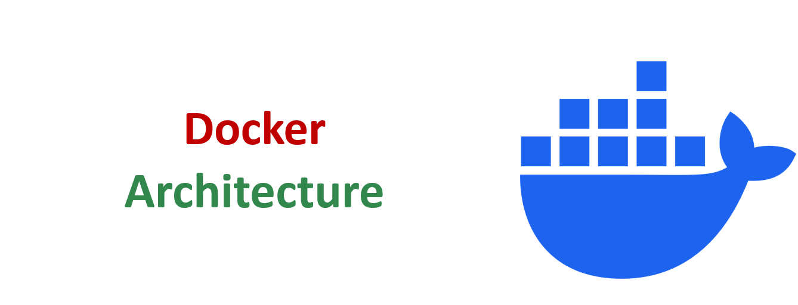
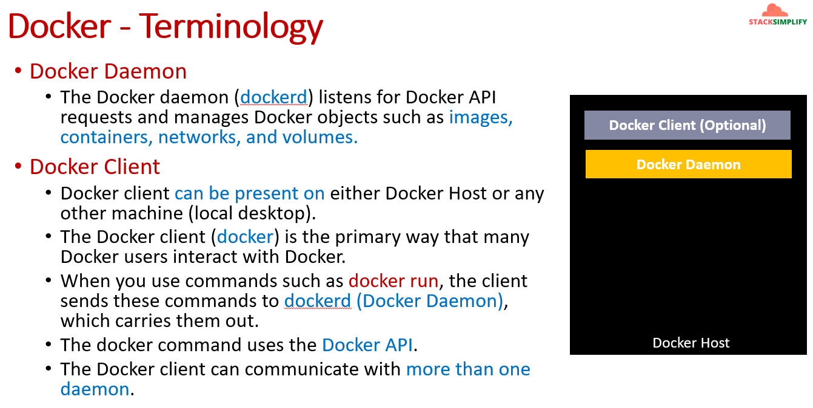
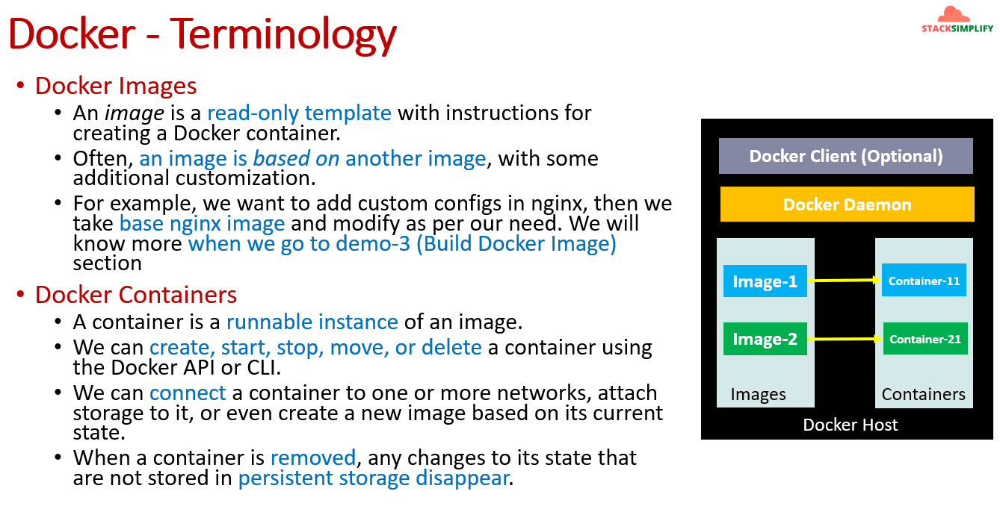
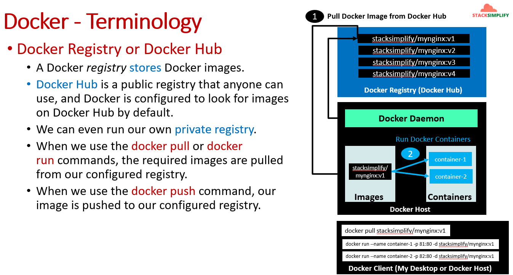

# Docker Architecture — Complete Theory Guide

> **Module:** 00 — Docker Terminology & Architecture  
> **Source:** StackSimplify Docker Masterclass  
> **Visual references:** [images/docker-arch/](../images/docker-arch/)



---

## Table of Contents

1. [Introduction (Why & What)](#1-introduction-why--what)
2. [Internal Working (How)](#2-internal-working-how)
3. [Real-World Context](#3-real-world-context)
4. [Interview Preparation](#4-interview-preparation)
5. [Summary](#5-summary)
6. [Quick Reference — Visual Curriculum](#quick-reference--visual-curriculum)

---

## 1. Introduction (Why & What)

### What is Docker Architecture?

**Docker architecture** is the way Docker components work together. Think of it as a small team:

| Role | Component | Simple analogy |
|------|-----------|----------------|
| You give orders | **Docker Client** | Remote control |
| Work gets done | **Docker Daemon** | Factory manager on the server |
| Blueprints | **Docker Images** | Recipe cards |
| Running apps | **Docker Containers** | Dishes made from the recipe |
| Warehouse | **Docker Registry** | Image library (Docker Hub, ACR, ECR) |

You type a command → the **client** sends it → the **daemon** on the **Docker Host** does the work → images and containers are created or managed → images can be pulled from or pushed to a **registry**.

### Why Do You Need to Understand Architecture?

Before running `docker run` or `docker build`, it helps to know **who does what**. That makes troubleshooting easier:

- Command fails? Check if the **client** can reach the **daemon**.
- Image not found? Check the **registry** or local images on the **host**.
- Container won't start? Check the **daemon** logs and container state.

### The Big Picture

```
┌─────────────────────────────────────────────────────────────────┐
│                     Docker Registry (Docker Hub)                │
│              stacksimplify/mynginx:v1, v2, v3, v4               │
└───────────────────────────┬─────────────────────────────────────┘
                            │  docker pull / docker push
                            ▼
┌─────────────────────────────────────────────────────────────────┐
│                        Docker Host                              │
│  ┌───────────────────────────────────────────────────────────┐  │
│  │  Docker Client (optional — can be on same or remote host) │  │
│  └───────────────────────────┬───────────────────────────────┘  │
│                              │ Docker API                       │
│  ┌───────────────────────────▼───────────────────────────────┐  │
│  │  Docker Daemon (dockerd)                                    │  │
│  │  Manages: images, containers, networks, volumes             │  │
│  └───────────────────────────┬───────────────────────────────┘  │
│                              │                                   │
│         ┌────────────────────┴────────────────────┐           │
│         ▼                                         ▼             │
│    ┌─────────┐                              ┌─────────────┐     │
│    │ Images  │  ──creates──►                │ Containers  │     │
│    │ (templates)                             │ (running)   │     │
│    └─────────┘                              └─────────────┘     │
└─────────────────────────────────────────────────────────────────┘
```

---

## 2. Internal Working (How)

### Docker Host

The **Docker Host** is the machine where Docker is installed and where the **Docker Daemon** runs. It can be:

- Your laptop (WSL2, Linux, macOS)
- A cloud VM (AWS EC2, Azure VM)
- A bare-metal server in a data center

Everything that actually runs containers lives on the Docker Host — images stored locally, containers running, networks, and volumes.

---

### Docker Client



The **Docker Client** (`docker`) is how you talk to Docker. It is the main interface most people use.

**Key points:**

| Point | Explanation |
|-------|-------------|
| **Where it runs** | On the Docker Host **or** on another machine (your desktop connecting to a remote server) |
| **What it does** | Sends your commands to the daemon using the **Docker API** |
| **How you use it** | `docker run`, `docker pull`, `docker ps`, `docker build`, etc. |
| **Multiple daemons** | One client can talk to **more than one** daemon (e.g., local + remote) |

**Example flow:**

```
You type:  docker run -d -p 8080:80 nginx
                │
                ▼
Docker Client sends request via Docker API
                │
                ▼
Docker Daemon receives request and starts the container
```

> 📌 **Important:** The client does **not** run containers itself. It only sends requests. The **daemon** does the real work.

---

### Docker Daemon

The **Docker Daemon** (`dockerd`) is a background service that runs on the Docker Host.

**Responsibilities:**

- Listens for Docker API requests from the client
- **Manages Docker objects:**
  - **Images** — templates for containers
  - **Containers** — running (or stopped) application instances
  - **Networks** — how containers communicate
  - **Volumes** — persistent storage

```
┌─────────────────────────────────────┐
│           Docker Host               │
│  ┌───────────────────────────────┐  │
│  │  Docker Client    (optional)  │  │
│  └───────────────┬───────────────┘  │
│                  │ API              │
│  ┌───────────────▼───────────────┐  │
│  │  Docker Daemon (dockerd)       │  │
│  │  • images                     │  │
│  │  • containers                 │  │
│  │  • networks                   │  │
│  │  • volumes                    │  │
│  └───────────────────────────────┘  │
└─────────────────────────────────────┘
```

---

### Docker Images



An **image** is a **read-only template** with instructions for creating a container.

**Think of it like:** A recipe card — it tells you how to make the dish, but it is not the dish itself.

| Concept | Simple explanation |
|---------|-------------------|
| **Read-only** | You don't change the image while a container runs; you build a new image if you need changes |
| **Layered** | Images are often built on top of another image (base image + your customizations) |
| **Example** | Base `nginx` image + your `index.html` = your custom nginx image |

**Example from the curriculum:**

```
Base image:     nginx (official)
       +
Your changes:   custom config, HTML files
       =
Your image:     my-custom-nginx:v1
```

One image can be used to create **many containers** — same recipe, many dishes.

---

### Docker Containers

A **container** is a **runnable instance** of an image.

**Think of it like:** The actual dish cooked from the recipe.

| Action | What it means |
|--------|---------------|
| **Create** | Make a new container from an image |
| **Start** | Run the container |
| **Stop** | Pause the running process |
| **Move** | Relocate or recreate on another host (via image) |
| **Delete** | Remove the container |

**Relationships:**

```
Image-1  ──►  Container-11
Image-1  ──►  Container-12   (same image, multiple containers)
Image-2  ──►  Container-21
```

**Extra capabilities:**

- Connect a container to **one or more networks**
- Attach **storage** (volumes) for data that must survive restarts
- **Commit** a container's current state to create a **new image** (less common in modern workflows — prefer Dockerfile builds)

> ⚠️ **Ephemeral by default:** When a container is **removed**, any data **not** stored in persistent storage (volumes) is **lost**.

---

### Docker Registry and Docker Hub



A **Docker Registry** is a service that **stores** Docker images.

| Registry type | Description |
|---------------|-------------|
| **Docker Hub** | Public registry — available to everyone; Docker looks here **by default** |
| **Private registry** | Your own registry (Azure ACR, AWS ECR, Harbor, GitLab Registry) for internal images |

**Common commands:**

| Command | What happens |
|---------|--------------|
| `docker pull stacksimplify/mynginx:v1` | Download image from registry → store on Docker Host |
| `docker run ... stacksimplify/mynginx:v1` | If image not local, pull first, then create and start container |
| `docker push stacksimplify/mynginx:v1` | Upload your local image to the registry |

**Full workflow (from the diagram):**

```
Step 1 — Pull image from Docker Hub
────────────────────────────────────
Registry:  stacksimplify/mynginx:v1, v2, v3, v4
                    │
                    │  docker pull stacksimplify/mynginx:v1
                    ▼
Docker Host Images:  stacksimplify/mynginx:v1  (stored locally)


Step 2 — Run containers from the image
──────────────────────────────────────
docker run --name container-1 -p 81:80 -d stacksimplify/mynginx:v1
docker run --name container-2 -p 82:80 -d stacksimplify/mynginx:v1
                    │
                    ▼
Docker Host Containers:  container-1, container-2  (both from same v1 image)
```

> 📌 **One image, many containers:** The same `v1` image can power multiple containers on different ports — each container is an isolated instance.

---

### How All Components Connect — End-to-End

```
┌──────────────────┐
│  Docker Client   │  My Desktop (or same Docker Host)
│                  │
│  docker pull ... │
│  docker run ...  │
│  docker push ... │
└────────┬─────────┘
         │ Docker API
         ▼
┌────────────────────────────────────────────────────────┐
│  Docker Host                                           │
│  ┌──────────────────────────────────────────────────┐  │
│  │  Docker Daemon                                   │  │
│  │    • Pulls/pushes images to/from registry        │  │
│  │    • Creates and manages containers              │  │
│  │    • Manages networks and volumes                │  │
│  └──────────────────────────────────────────────────┘  │
│                                                        │
│  Local Images ◄──► Containers (running instances)      │
└────────────────────────┬───────────────────────────────┘
                         │ pull / push
                         ▼
┌────────────────────────────────────────────────────────┐
│  Docker Registry (Docker Hub / Private Registry)       │
│  stacksimplify/mynginx:v1, v2, v3, v4                  │
└────────────────────────────────────────────────────────┘
```

---

### Architecture from Different Perspectives

#### Developer perspective

```
Write Dockerfile  →  docker build  →  local image  →  docker run (test)
                                              │
                                              ▼
                                    docker push  →  Registry
```

Developers care about **images** (how the app is packaged) and **containers** (running locally for dev/test).

#### Operations perspective

Ops teams care about the **daemon** on each host, **registry** access, resource limits, networking, volumes, and monitoring container health across many hosts (often via Kubernetes).

#### End-user / consumer perspective

You only need the **client** and access to a registry:

```bash
docker pull stacksimplify/mynginx:v1
docker run --name myapp -p 8080:80 -d stacksimplify/mynginx:v1
```

No Dockerfile required — just pull and run a pre-built image.

#### Remote client perspective

The Docker Client does **not** have to sit on the same machine as the daemon:

```
Your Laptop (Client)  ──SSH/Docker API──►  Remote Server (Daemon + Host)
```

Set `DOCKER_HOST` to point the client at a remote daemon — common in CI/CD and remote development.

---

### Docker API — The Glue Between Client and Daemon

Every `docker` command uses the **Docker API** under the hood:

| You type | API does |
|----------|----------|
| `docker ps` | List containers |
| `docker images` | List images |
| `docker run` | Create + start container |
| `docker pull` | Download image layers from registry |
| `docker network create` | Create a network |

The client is a thin wrapper; the daemon implements the API and performs the operations.

---

### Objects the Daemon Manages — Quick Reference

| Object | What it is | Analogy |
|--------|------------|---------|
| **Image** | Read-only template | Recipe / blueprint |
| **Container** | Running instance of an image | Running app / dish |
| **Network** | Virtual network for container communication | LAN for containers |
| **Volume** | Persistent storage outside container filesystem | External hard drive |
| **Registry** | Remote image store (not on host, but daemon talks to it) | Cloud photo album for images |

---

## 3. Real-World Context

### Production Use Cases

| Scenario | Architecture in play |
|----------|---------------------|
| **Pull official images** | Client → Daemon → Docker Hub (`docker pull nginx`) |
| **Private company images** | Client → Daemon → Azure ACR / AWS ECR (private registry) |
| **CI/CD build pipeline** | CI agent (client) → build on daemon → push to registry → deploy pulls on prod host |
| **Multi-container app** | One daemon manages multiple containers + networks + volumes on same host |
| **Remote Docker host** | Developer laptop (client) → API → build server (daemon) |

### Real-World Example — Deploying Nginx

```bash
# Step 1: Pull from Docker Hub (registry → host)
docker pull stacksimplify/mynginx:v1

# Step 2: Run two instances on different ports (image → containers)
docker run --name web-1 -p 81:80 -d stacksimplify/mynginx:v1
docker run --name web-2 -p 82:80 -d stacksimplify/mynginx:v1

# Step 3: Verify (client asks daemon)
docker ps
```

**What happened behind the scenes:**

1. Client sent `pull` → daemon contacted Docker Hub → image layers downloaded to host
2. Client sent `run` twice → daemon created two isolated containers from the same image
3. Client sent `ps` → daemon returned list of running containers

### Comparison — Where Each Component Lives

| Component | Dev laptop | CI server | Production VM | Cloud (ACR/ECR) |
|-----------|------------|-----------|---------------|-----------------|
| Docker Client | ✅ | ✅ | ✅ (optional) | ❌ |
| Docker Daemon | ✅ | ✅ | ✅ | ❌ |
| Images (local) | ✅ | ✅ (temp) | ✅ | ❌ (stored in registry) |
| Containers | ✅ | ✅ (test) | ✅ | ❌ |
| Registry | Uses Docker Hub | Push target | Pull source | ✅ (image storage) |

### Connection to Kubernetes

In Kubernetes, you typically don't SSH in and run `docker` commands on nodes. But the same concepts apply:

```
Dockerfile  →  Image (in registry)  →  containerd/CRI  →  Pod (one or more containers)
```

Kubernetes uses a **container runtime** (containerd) on each node — similar role to the Docker daemon, but orchestrated by the Kubernetes control plane instead of manual `docker run` commands.

---

## 4. Interview Preparation

### Beginner Questions

**Q1: What are the main components of Docker architecture?**  
A: Docker **Client**, Docker **Daemon**, Docker **Host**, **Images**, **Containers**, and **Registry** (e.g., Docker Hub).

**Q2: What is the difference between Docker Client and Docker Daemon?**  
A: The **client** sends commands (`docker run`, `docker pull`). The **daemon** (`dockerd`) receives those commands via the Docker API and actually creates/manages images, containers, networks, and volumes.

**Q3: What is a Docker image?**  
A: A read-only template with instructions for creating a container. Often built on top of a base image with custom layers.

**Q4: What is a Docker container?**  
A: A runnable instance of an image. You can create, start, stop, and delete containers.

**Q5: What is Docker Hub?**  
A: A public Docker registry where images are stored and shared. Docker is configured to search Docker Hub by default when you pull an image.

**Q6: What happens when you run `docker pull nginx`?**  
A: The client tells the daemon to download the `nginx` image from the configured registry (Docker Hub by default) and store it locally on the Docker Host.

**Q7: Can the Docker Client run on a different machine than the Daemon?**  
A: Yes. The client can be on your desktop and connect to a remote daemon via the Docker API (e.g., `DOCKER_HOST` environment variable).

---

### Intermediate Questions

**Q1: What objects does the Docker Daemon manage?**  
A: Images, containers, networks, and volumes.

**Q2: What is the relationship between an image and a container?**  
A: An image is the template; a container is a running (or stopped) instance of that image. One image can create many containers.

**Q3: What happens to container data when the container is deleted?**  
A: Any changes not stored in a **volume** or other persistent storage are **lost**. Containers are ephemeral by default.

**Q4: Explain `docker pull` vs `docker push`.**  
A: `docker pull` downloads an image from a registry to the local host. `docker push` uploads a locally built image to a registry.

**Q5: Why is the Docker Client marked as "optional" on the Docker Host diagram?**  
A: Because the client can run elsewhere (remote machine, CI server). Only the **daemon** must run on the Docker Host.

**Q6: Can one client communicate with multiple daemons?**  
A: Yes. The Docker client can be configured to talk to more than one daemon.

**Q7: What is a private registry and when would you use one?**  
A: A registry you control (ACR, ECR, Harbor) for storing proprietary or internal images instead of publishing them publicly on Docker Hub.

---

### Advanced Questions

**Q1: How does the Docker Client communicate with the Daemon?**  
A: Through the **Docker API** — a REST API. The `docker` CLI is a client that wraps this API.

**Q2: What is the difference between Docker Registry and Docker Repository?**  
A: A **registry** is the overall service (e.g., Docker Hub). A **repository** is a collection of related images under one name (e.g., `stacksimplify/mynginx` with tags v1, v2, v3).

**Q3: Explain the full flow from `docker run` when the image is not local.**  
A: Client sends `run` → daemon checks local images → image not found → daemon pulls from registry → image stored on host → daemon creates container → daemon starts container → returns container ID to client.

**Q4: How does Docker architecture relate to containerd and runc?**  
A: Modern Docker uses **containerd** as the container runtime and **runc** as the low-level OCI runtime. The Docker daemon orchestrates these; Kubernetes often uses containerd directly without the Docker daemon.

**Q5: What is the role of networks and volumes in Docker architecture?**  
A: **Networks** let containers communicate in isolation. **Volumes** provide persistent storage that survives container deletion — both are managed by the daemon.

**Q6: Why might you run Docker Client remotely but daemon on a server?**  
A: Security (don't install dev tools on prod), resource usage (build on powerful server), or CI/CD patterns where build agents trigger remote builds.

---

### Scenario-Based Questions

**Q1: You run `docker run nginx` on a fresh machine with no local images. What happens?**  
A: Client sends command to daemon → daemon finds no local `nginx` image → pulls from Docker Hub (default registry) → stores image on host → creates and starts container.

**Q2: You need two web servers from the same image on ports 81 and 82. How does architecture support this?**  
A: One image (`stacksimplify/mynginx:v1`) on the host; daemon creates two separate containers (`container-1`, `container-2`) with different port mappings — isolated processes, same template.

**Q3: Your team cannot push images to public Docker Hub. What architecture change do you make?**  
A: Set up a **private registry** (ACR/ECR/Harbor), configure daemon authentication, use `docker push` to private registry and `docker pull` from it in deployment.

**Q4: `docker ps` works but `docker run` fails with "Cannot connect to Docker daemon." What does that tell you?**  
A: Unlikely both would behave differently if daemon is down — usually indicates permission issues, different `DOCKER_HOST` contexts, or daemon socket access problems. Check daemon status, user group (`docker` group), and socket path.

**Q5: A developer commits a running container instead of using a Dockerfile. What's the architectural concern?**  
A: `docker commit` creates an image from container state, but it's not reproducible. Architecture best practice: **Dockerfile → build → image → registry** for traceable, repeatable deployments.

---

## 5. Summary

### Key Takeaways

1. **Docker architecture** is a client–server model: **Client** sends commands, **Daemon** executes them on the **Docker Host**.
2. **Images** are read-only templates; **containers** are running instances — one image, many containers.
3. **Registry** (Docker Hub or private) stores and distributes images; `pull` brings them to the host, `push` publishes them.
4. The daemon also manages **networks** and **volumes** — not just images and containers.
5. The client can run **locally or remotely** and can talk to **multiple daemons**.

### Remember This

> **Client** = you ask  
> **Daemon** = Docker does  
> **Image** = blueprint  
> **Container** = running app  
> **Registry** = image warehouse  

```
docker pull  →  image on host
docker run   →  container from image
docker push  →  image to registry
```

---

## Quick Reference — Visual Curriculum

| Image | Topic |
|-------|-------|
| [01-docker-arch.png](../images/docker-arch/01-docker-arch.png) | Module title — Docker Architecture |
| [02-docker-arch.png](../images/docker-arch/02-docker-arch.png) | Docker Client and Docker Daemon |
| [03-docker-arch.png](../images/docker-arch/03-docker-arch.png) | Docker Images and Containers |
| [04-docker-arch.png](../images/docker-arch/04-docker-arch.png) | Docker Registry, pull & run workflow |

**Previous module:** [Why Docker?](./02-why-docker.MD) · **Next module:** [Study Plan](./01-study-plan.md)
